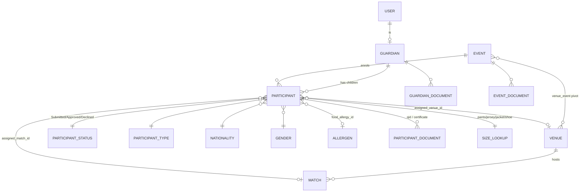

# CLAUDE.md — YPI Participant Management Platform

> **Purpose of this document:** a complete functional and technical brief of the *existing* application, written so that a designer/architect can propose a **better product design** for a rewrite on **Laravel 13 + Vue 3 + Inertia.js**.
>
> Read this as "here is what the system does and where it hurts" — not as a spec to copy.

---

## 1. What the product is

**YPI** is an internal **event participant management platform** for a youth sports/participation programme (Qatar-based, Arabic/English audience).

The lifecycle it manages:

1. A **guardian** (parent) registers and enrols one or more **participants** (children) into an **event**.
2. The guardian supplies personal details, QID (Qatari national ID) and supporting **documents**.
3. A **SuperAdmin** reviews each participant and **approves** or **declines** the application.
4. Downstream operational teams consume the approved roster:
   - **Uniform** team → collects/fulfils clothing sizes (pants, jersey, jacket, shoes).
   - **Catering** team → collects dietary/allergen and health information.
   - **Operations** → assigns participants to **venues** and **matches**.
5. Email notifications, Excel exports, PDF/QR artefacts and an audit trail wrap the whole flow.

Everything is **scoped to an Event**. Most screens operate "within the currently selected event".

---

## 2. Personas & roles (Spatie roles, live in DB)

| Role | Who they are | What they do today |
|---|---|---|
| `SuperAdmin` | Programme administrators | Full access: review/approve participants, manage events, venues, lookups, users, email templates, import/export |
| `Customer` | **Guardians / parents** — the public-facing users | Self-register, create & edit their participants, upload documents, track approval status |
| `Uniform` | Uniform/kit team | Read-only roster of approved participants + their sizes, export CSV |
| `Catering` | Catering team | Read-only roster of approved participants + allergens/health notes, export CSV |
| `SecurityRole` | Security/compliance | Audit log, role & permission administration, admin user management |
| `Manager`, `Operator` | Partially-used operational roles | Currently thin; intended for venue/match day operations |

> **Design note:** guardians and staff share the *same* Laravel app, the same login, and almost the same Bootstrap admin shell. This is one of the biggest UX problems — a parent on a phone gets an admin dashboard chrome.

---

## 3. Core domain model

### Entities and relationships

### Actual table columns (current production schema)

**`events`** — `id, name, start_date, end_date, event_logo, active_flag, created_at, updated_at, created_by, updated_by`
*(the events table is deliberately thin; a legacy migration describes a much richer table that was never used)*

**`participants`** — `id, reference_number, status_id, seq_no, event_id, full_name, participant_type_id, qid, date_of_birth, age, gender_id, nationality_id, school_name, guardian_id, pants_size_id, jersey_size_id, jacket_size_id, shoe_size_id, food_allergy, food_allergy_id, food_allergy_others, health_issues, health_issues_details, assigned_venue_id, assigned_match_id, created_by, updated_by, timestamps`

**`guardians`** — `id, user_id, event_id, qid, full_name, email, phone_main, phone_secondary, timestamps`

**`participant_statuses`** — exactly three rows: `1 Submitted (warning)`, `2 Approved (success)`, `3 Declined (danger)`

**`size_lookups`** — polymorphic sizing table: `type ∈ {pant, jersey, jacket, shoe}`, plus `event_id` (nullable = global), label, sort order, active flag

**Event-scoped lookups** — `participant_types`, `nationalities`, `size_lookups` all carry a nullable `event_id`. `NULL` means "shared across all events"; a value means "this event only".

**Documents** — `participant_documents`, `guardian_documents`, `event_documents` all share the shape `{owner_id, category, disk, path, original_name, mime, size, created_by}`. Files live on a private disk and are streamed through controllers.

**Support tables** — `roles/permissions/model_has_roles/...` (Spatie), `audits` (owen-it/laravel-auditing), `email_templates`, `email_template_attachments`, `email_logs`, `notifications`, `jobs`, `failed_jobs`, `ms_graph_tokens`, `personal_access_tokens`, `temp_uploads`.

---

## 4. Current technology stack (what we are replacing)

| Layer | Current |
|---|---|
| Framework | Laravel 11, PHP 8.1 |
| Rendering | **Blade, server-rendered, full page reloads** |
| Interactivity | **jQuery 3 + a very large pile of vendor plugins** |
| CSS | Bootstrap 5.2 + "Phoenix/Tracki" purchased admin theme + a stray Tailwind 3 install that is barely used |
| Tables | `bootstrap-table` (server-side, `data-url` + `queryParams`) **and** DataTables in different places |
| Forms | Bootstrap modals, one modal per create + one per edit, populated via jQuery `$.ajax` → `$('#field').val(...)` |
| Pickers | flatpickr (`.datetimepicker` + `data-options`), Select2, Choices.js, TinyMCE, Dropzone, FilePond, Dropify |
| Feedback | toastr + SweetAlert2 |
| Auth | Laravel Breeze + **Microsoft Entra ID via Socialite** + a custom **OTP** gate (`otp` middleware) + single-session enforcement |
| Authorization | spatie/laravel-permission, enforced with `role:` middleware on route groups |
| Files | FilePond → `temp_uploads` → committed to final path on form save |
| Exports | maatwebsite/excel |
| PDF | dompdf + spatie/laravel-pdf (browsershot) — two competing generators |
| Email | DB-driven `email_templates` rendered by `TemplatedEmailService`, sent via queued jobs |
| Audit | owen-it/laravel-auditing |
| Build | Vite 4, but only `resources/js/app.js` + `resources/css/app.css`; ~95% of the JS is hand-written files under `public/assets/js/pages/**` loaded with `<script src>` |

---

## 5. Screen inventory (what exists today)

### Guardian / Customer portal (`/ypi/customer/guardian/*`)
- **Guardian profile** — name, QID, email, two phone numbers.
- **Participant list** — cards/table of the guardian's children with status badge.
- **Participant create / edit** — one long form: identity (full name, QID, DOB → auto-computed age, gender, nationality, school), participant type, four size dropdowns, allergen + free-text "other", health issues + details, plus **QID document upload** (FilePond).
- **Status tracking** — the guardian sees Submitted / Approved / Declined.

### Admin — participants (`/ypi/admin/participant/*`)
- Server-side `bootstrap-table` roster with search, per-event filter, column toggles, export.
- Row actions: view detail, edit, **approve / decline** (triggers email), delete.
- Document viewer / downloader for QID + certificates.
- Bulk **Excel import/export**.

### Admin — settings (`/ypi/setting/*`)
Each of these is the *same* CRUD pattern (list table + "create" modal + "edit" modal + delete confirm):
- **Events** — name, logo, start/end date, venue assignment (multi-select), active flag, event documents.
- **Venues** — venue details, many-to-many with events.
- **Participant types**, **Nationalities**, **Sizes** (pant/jersey/jacket/shoe) — each with an "applies to: this event only / all events" scope selector.
- **Application settings**.

### Uniform (`/ypi/uniform/*`) and Catering (`/ypi/catering/*`)
- Read-only roster of approved participants for the selected event.
- Uniform shows the four size columns; Catering shows allergen + health columns.
- Each has a CSV/Excel export.
- Event is chosen from an **offcanvas drawer** and stored in the session (`participant_filter_event_id`).

### Security (`/sec/*`)
- Audit log browser, role/permission/group CRUD, admin user management, invite-by-signed-link.

### Admin — email templates (`/admin/email-templates/*`)
- CRUD over DB-stored templates, variable placeholders, attachments, preview, send test.

### Auth
- Login (password **or** Microsoft SSO) → **OTP challenge** → first-login password change → **event selection** → role-specific landing page.

---

## 6. Key workflows in detail

### 6.1 Enrolment → approval
1. Guardian signs up (or is invited via signed URL) and verifies OTP.
2. Guardian creates participant(s); `reference_number` and `seq_no` are generated; status = **Submitted**.
3. QID document uploaded via FilePond into `temp_uploads`, then committed on save.
4. Admin filters the roster by event, opens the participant, reviews the document.
5. Admin sets status to **Approved** or **Declined** → queued job sends the matching templated email → `email_logs` row written → `audits` row written.
6. Approved participants become visible to Uniform, Catering and venue/match assignment.

### 6.2 Event scoping (important and currently messy)
- There is a **global event switcher** writing `EVENT_ID` to the session (`/event/switch`, `/event/clear`).
- There is **also** a second, separate per-module filter writing `participant_filter_event_id` from an offcanvas drawer in Catering/Uniform.
- Lookup tables resolve as "rows where `event_id = current_event` **OR** `event_id IS NULL`".
- **This dual mechanism is a bug farm and should be unified in the redesign.**

### 6.3 Document handling
- Upload → `POST /uploads/process` (FilePond) → temp row.
- Form save → move file to `uploads/{entity}/{id}/` on the `private` disk → create document row.
- Deletes are **staged** in a hidden `delete_doc_ids` JSON input and only applied when the form is saved.
- Download/view goes through a controller that checks ownership.

---

## 7. Known problems — the reasons for the rewrite

These are the things the new design must solve. Please treat this section as the design brief.

### Architecture / code
1. **Two modals per entity.** Every CRUD screen ships a `create_X_modal` and a near-identical `edit_X_modal`, with duplicated markup and a bespoke jQuery block that hydrates the edit modal field-by-field from an AJAX payload. Adding one field means touching a migration, a controller (×2 validation blocks), two Blade modals, a JS hydrator and a table column definition.
2. **HTML built inside controllers.** The `list()` methods return HTML strings (`'
' . $x . '
'`) as JSON fields for bootstrap-table. Presentation lives in PHP. This blocks any real API, is a latent XSS surface, and makes the tables untestable.
3. **No shared table component.** Each list re-declares 25 `data-*` attributes and its own `queryParams`/formatter functions.
4. **Validation duplication and drift.** Store and update rules are copy-pasted; no Form Request objects.
5. **Date format chaos.** flatpickr posts `d/m/Y`, MySQL wants `Y-m-d`, some fields are native `<input type="date">`, some are casted, some are not.
6. **Mixed table libraries** (bootstrap-table + DataTables), **mixed file uploaders** (FilePond + Dropzone + Dropify), **mixed PDF engines** (dompdf + browsershot), **mixed CSS systems** (Bootstrap theme + unused Tailwind).
7. **Dead / duplicated code** — several `*.blade copy.php`, `*Controller copy.php`, `web copy.php`, `queue.php.bak` files are still in the tree.
8. **Global JS in `public/`** — no bundling, no modules, no types; scripts rely on globals (`window.EventPondEdit`, `label_update`, …).

### UX
9. **Guardians get an admin UI.** Parents — often on mobile, often Arabic-first — are shown a dense staff dashboard. The enrolment form is one long unstructured column with 20+ fields and no progressive disclosure.
10. **No visible status journey.** A guardian only sees a coloured badge. There is no timeline, no reason-for-decline surfaced in the UI, no "what happens next".
11. **Approval is a row action, not a review experience.** Admins approve from a table row without a side-by-side view of the participant's data and their uploaded QID. No bulk approve. No queue/inbox metaphor.
12. **Event context is invisible and duplicated.** Users cannot reliably tell which event they are operating on, and two competing selectors exist.
13. **Full page reloads everywhere**, modal-in-modal patterns, and a "close modal / refresh table" loop for every action.
14. **No dashboard.** There is no at-a-glance view of enrolment volume, pending-review backlog, size distribution for procurement, or allergen counts for catering — even though every one of those numbers is a single query.
15. **RTL/Arabic support is theme-level only** and untested; the domain is bilingual by nature.
16. **Accessibility** — modals without focus management, colour-only status encoding, icon-only buttons, no keyboard paths.

---

## 8. Target stack for the redesign

| Layer | Target |
|---|---|
| Backend | **Laravel 13**, PHP 8.4+ |
| Transport | **Inertia.js 2** (server-driven routing, no separate API layer to maintain) |
| Frontend | **Vue 3** `<script setup>` + **TypeScript** |
| Styling | **Tailwind CSS 4** + a headless component layer (shadcn-vue / Reka UI / PrimeVue — your call) |
| Build | Vite 6 |
| Tables | One reusable `<DataTable>` Vue component fed by a Laravel **Resource** + a query-object service (`Spatie\QueryBuilder` style) — **no HTML from controllers** |
| Forms | One reusable form component per entity, driven by Inertia `useForm`, used for both create and edit (no duplicate modals) |
| Validation | **Form Request** classes shared by store + update, errors surfaced through Inertia |
| Auth | Laravel Fortify/Breeze-Inertia + Socialite (Entra ID) + the existing OTP step |
| Authorization | Keep spatie/laravel-permission; expose abilities to the frontend so the UI hides what the user cannot do |
| Uploads | One uploader (keep FilePond or move to a Vue-native dropzone) with a single temp→commit service |
| Exports | Keep maatwebsite/excel, queued |
| PDF | Pick **one** engine |
| i18n | `vue-i18n` + Laravel translations, **EN/AR with full RTL** |

---

## 9. What I want from you (the design ask)

Produce a **product + UI design proposal**, not code. Specifically:

1. **Information architecture** — a navigation and screen map per role. Decide whether guardians get a separate, mobile-first portal (strongly suggested) or a re-skinned area of the same app.
2. **A unified event-context model** — one selector, one source of truth, always visible, with a clear rule for global vs event-scoped lookup data.
3. **A guardian enrolment experience** — multi-step, save-as-draft, mobile-first, bilingual, with clear document upload guidance and a status timeline after submission.
4. **An admin review experience** — a review queue/inbox with document preview side-by-side, keyboard shortcuts, bulk approve/decline, and a required reason on decline that reaches the guardian.
5. **A canonical CRUD pattern** — one design for list + filter + create/edit + delete that every settings entity reuses, replacing the 6 duplicated modal pairs. Specify whether edit is a slide-over, a modal, or a dedicated page, and justify it.
6. **Operational dashboards** — for Uniform (size distribution, procurement quantities), Catering (allergen counts, dietary breakdown), and Admin (pending backlog, enrolment over time, capacity vs forecast per venue/match).
7. **A component inventory** — the Vue components the new frontend needs, with props and states (empty, loading, error, permission-denied).
8. **A design system** — tokens, typography (Latin + Arabic), spacing, status colour semantics that are not colour-only, and dark mode.
9. **A migration path** — which screens to rebuild first, and how the old Blade app and the new Inertia app can coexist during the transition.

### Constraints to respect
- The **database schema and its data are live**; propose schema improvements explicitly and separately, do not assume a clean slate.
- **Entra ID SSO + OTP** must stay in the login flow.
- **Auditing** of every create/update/delete must stay.
- **Arabic/RTL** is a first-class requirement, not an afterthought.
- Users include **non-technical parents on low-end mobile devices** on the guardian side, and **high-volume data workers** on the admin side. These two audiences need genuinely different interfaces.
